# RK01 – RK05 Widgets

> Automatisch aus `RK01-05 Widgets Doku 1.1.x.docx` erzeugt, damit Änderungen an der Doku in GitHub zeilenweise nachvollziehbar sind. Maßgeblich ist die Word- bzw. PDF-Datei in diesem Ordner.

## Darstellungsvariante der Kopfzeile

### Kopfzeile Feld 1 zugewiesen RK04

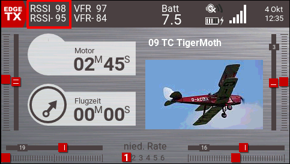

### Kopfzeile Feld 2 zugewiesen RK04

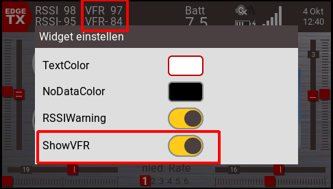

### Kopfzeile Feld 2 zugewiesen RK04

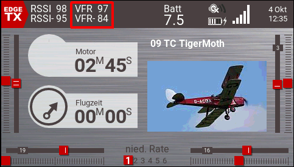

## Darstellungsvariante der Widget Seiten 1-5 im Flug (Modell eingeschaltet)

### Widget-Seite 1 nach eigenem Bedarf z.B.

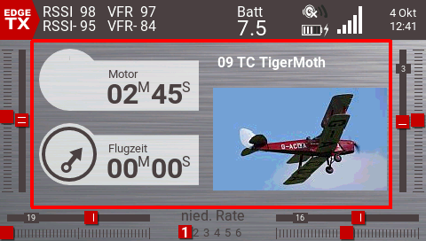

### Widget-Seite 2 zugewiesen RK01

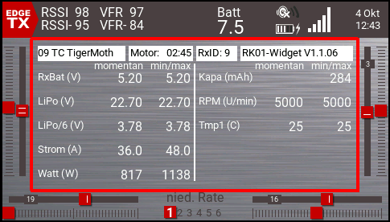

Vollbild (mit Trims, Flugphasen, Schieber)

### Widget-Seite 3 zugewiesen RK02

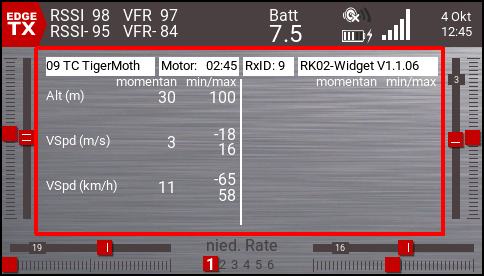

Vollbild (mit Trims, Flugphasen, Schieber)

### Widget-Seite 4 zugewiesen RK03

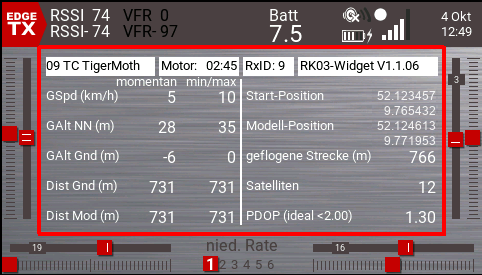

Vollbild (mit Trims, Flugphasen, Schieber)

### Widget-Seite 5 zugewiesen RK05

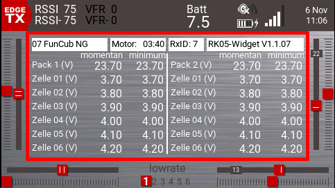  
Vollbild (mit Trims, Flugphasen, Schieber)

## Darstellungsvariante der Widget Seiten 1-5 nach Flug (Modell ausgeschaltet)

### Widget-Seite 2 zugewiesen RK01

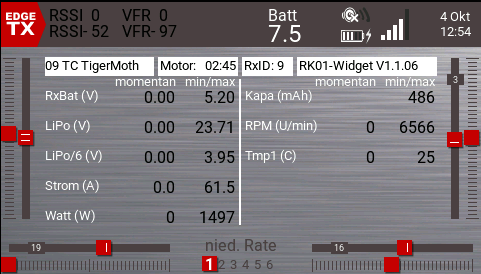  
Alle min/max Werte bleiben bis zum Reset oder Modellwechsel erhalten

### Widget-Seite 3 zugewiesen RK02

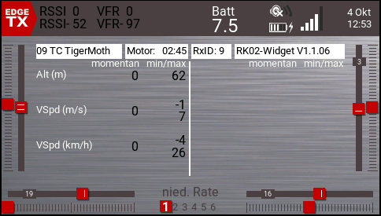  
Alle min/max Werte bleiben bis zum Reset oder Modellwechsel erhalten

### Widget-Seite 4 zugewiesen RK03

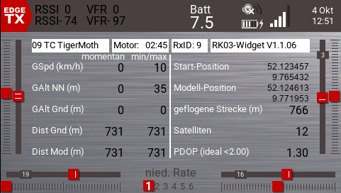  
Alle min/max Werte bleiben bis zum Reset oder Modellwechsel erhalten

### Widget-Seite 5 zugewiesen RK05

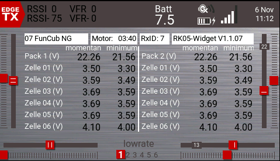  
Alle min Werte bleiben bis zum Reset oder Modellwechsel erhalten. Auch die letzte momentan Spannung wird weiterhin angezeigt.

  

## Konfigurationsmöglichkeiten

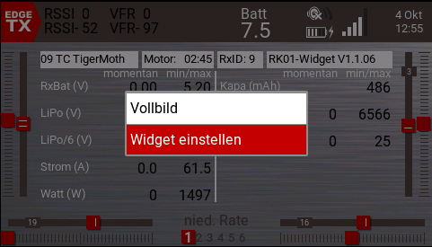

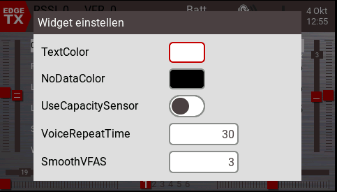

**TextColor**  
=> die Farbe für Werte bei aktiven Sensoren, Standard ist Weiß  
verfügbar in RK01, RK02, RK03, RK04 und RK05

**NoDataColor**  
=> die Farbe für Werte bei inaktiven Sensoren, Standard ist Schwarz  
verfügbar in RK01, RK02, RK03, RK04 und RK05

**UseCapacitySensor**  
=> EIN: für die Verbrauchsermittlung(mAh) wird ein Sensor (A4, EscC, Capa, Kapa oder 5123) verwendet, Standard ist AKTIV  
=>AUS: die Verbrauchsermittlung(mAh) wird anhand des Stromsensors (Curr) berechnet  
verfügbar in RK01

**VoiceRepeatTime**  
=> nach wieviel Sekunden die Sprachansage für die Werte wiederholt wird, Standard sind 30Sekunden  
Verfügbar in RK01, RK02

**SmoothVFAS**  
=> aus wieviel Messungen wird ein Durchschnittswert gebildet, um VFAS geglättet anzuzeigen. 1 bedeutet keine Glättung.

## Voraussetzung

- Radiomaster TX16S, FrSky Horus X10(S) oder Horus X12(S) oder ähnliche Sender mit Farbdisplay und dieser Auflösung und mit EdgeTx 2.10.0 oder neuer.
- ein logischer Schalter, der zum resetten benutzt wird   
(standardmäßig wird auf LS61 reagiert, ist aber in der "RK-Settings\RK-Settings.lua" über PC änderbar)
- das int. oder ext. HF-Modul muss aktiv sein und die Empfänger ID darf nicht 0 sein, damit der manuelle Reset bzw. der Autoreset (beim Modellwechsel) funktioniert
- die Verzeichnisse "RK01", "RK02", "RK03", "RK04", "RK05" und "RK-Settings" müssen auf die SD-Karte in das "WIDGETS" Verzeichnis kopiert werden
-  aus dem Verzeichnis "SOUNDS de Sprachdateien" müssen die WAV-Dateien auf die SD-Karte ins Verzeichnis "SOUNDS\de" kopiert werden
- die vier Widgets RK01, RK02, RK03 und RK05 müssen jeweils einem Vollbildscreen zugewiesen werden
- RK04 ist geeignet, um auf die „Top-Bar“ hinzugefügt zu werden. Hier können RSSI und VFR (momentan und minimal Werte) angezeigt werden. Außerdem kann RK04 auch die akustische Warnung bei schlechtem RSSI-Wert übernehmen. Diese wird dann verzögert ausgegeben, da das interne System oft zu schnell die akustische Warnung ausgibt. Dann muss allerdings auf der Telemetrie-Seite des Modellspeichers die Systemeigene RSSI-Warnung deaktiviert werden, indem die Werte für Warnung Kritsch auf 1 gesetzt werden. Die Schwellen für die RSSI-Warnung sind 35 Warnung und 32 für Kritisch.

## Sensoreinrichtung

- Sensoren (z.B. Unisens-E) anschließen und Sensorsuche starten, einen Moment warten und wieder beenden.
- den "A4" Kapazitätssensor (falls vorhanden) editieren und auf die Einheit "mAh" ändern  
Nutzt man die neueste Firmware 1.21 des Unisens-E ist der Sensor „EscC“ automatisch auf "mAh" eingestellt. Ab 1.1.xx werden auch Sensornamen wie „Capa“, „Kapa“ oder „5123“ gelesen.
- als Vario Quelle "VSpd" auswählen
- GPS-Sensor anschließen und Sensorsuche starten, einen Moment warten und wieder beenden (u.U. werden erst Sensoren gefunden, nachdem ein GPS-Fix erfolgt ist)
- den "GSpd" Sensor editieren und auf die Einheit "kmh" ändern

HINWEIS: es können natürlich auch andere Sensoren angeschlossen werden. Hier die Liste, mit welchen Sensornamen die Widgets arbeiten:

RSSI, RxBt, VFR, VFAS, Curr, A4 oder EscC oder Capa oder Kapa oder 5123, Alt, VSpd, GPS, GAlt, GSpd, Sats oder 5100, PDOP oder 5101, RPM, Tmp1, Cels, Cel2

RSSI = RSSI, Received Signal Strength Indication (Empfänger)

RxBt = Empfänger Spannungsversorgung (Empfänger)

VFR  = ValidFrameRate (Empfänger)

VFAS = Flugakku gesamt Spannung (separater Sensor oder A2 aus Empfänger. Dann muss A2 in VFAS umbenannt werden). Wird nur eine MLVSS, FLVSS oder FLVS-ADV eingesetzt, wird ein berechneter Sensor „VFAS“ angelegt, der „Cels“ und falls vorhanden „Cel2“ addiert.

Curr = Strom aus Flugakku (separater Sensor)

A4, EscC, Capa, Kapa oder 5123  = entnommene Kapazität aus Flugakku (separater Sensor)

ALT  = Flughöhe (separater Sensor oder Empfänger mit int. Höhenmesser)

VSpd = VerticalSpeed, Steig- und Sinkgeschwindigkeit (separater Sensor oder Empfänger mit int. Vario)

GPS  = GPS Koordinaten (separater Sensor)

GALT = GPS Höhe (separater Sensor)

GSpd = GPS Geschwindigkeit (separater Sensor)

Sats oder 5100 = Anzahl Satelliten

PDOP oder 5101 = PDOP, GPS Signalqualität

RPM = Drehzahl (z.B. aus ESC Hobbywing HW4)

Tmp1 = Temperatur (z.B. aus ESC Hobbywing HW4)

Cels = Akkupack1 Einzelzellenspannungsüberwachung (z.B. FrSky MLVSS, FLVSS, FLVS-ADV(mit oder ohne Display) mit Standardkonfiguration)

Cel2 = Akkupack2 Einzelzellenspannungsüberwachung (z.B. FrSky FLVSS, FLVS-ADV(mit oder ohne Display) mit geänderter ID z.B. ID2). __ACHTUNG:__ der MLVSS ist nicht geeignet, da er keine galvanische Trennung hat!

## Features RK01, RK02, RK03, RK04, RK05 Widgets

- es werden übersichtlich die Momentanwerte und min/max Werte angezeigt von:  
RK01: RxBat, VFAS, errechnete durchschnittliche Zellenspannung, Curr, errechnet Watt, RPM, Tmp1  
RK02: ALT, VSpd (m/s und kmh), VSpd steigen max (m/s und kmh), VSpd sinken max (m/s und kmh)  
RK03: GSpd, GPS ALT NN, GPS ALT über Grund, Distanz zum Modell über Grund, Distanz zum Modell Luftlinie, Anzahl Satelliten, PDOP  
RK04: RSSI, VFR, RSSI akustischer Alarm  
RK05: Cels, Cel2.Es werden die momentan und die minimal Einzelzellenspannungen auf einer Seite von bis zu 2 Akkupacks mit jeweils 6 Zellen angezeigt.  

- automatische Telemetrieansagen durch Schalter auslösbar  
im Standard werden folgende Schalterstellungen für Ansagen benutzt:  
  Schalter "SC" nach "oben" = aktuelle Höhe (Alt), wird alle 30 Sekunden wiederholt

  Schalter "SC" in der "Mitte" = keine Ansagen

  Schalter "SC" nach "unten" = aktuell verbrauchte Kapazität mAh, wird alle 30 Sekunden  
  wiederholt.  
  
  Schalter "SD" nach "oben" = maximalster Strom (Curr) (nur wenn Daten vorhanden!) und   
  danach minimalste durchschnittliche Einzelzellenspannung (wird aus "VFAS"  
  ermittelt), wird alle 30 Sekunden wiederholt

  Schalter "SD" in der "Mitte" = keine Ansagen

  Schalter "SD" nach "unten" = Momentanwert für Strom (Curr) (nur wenn Daten  
  vorhanden!) und danach durchschnittliche Einzelzellenspannung (wird aus "VFAS"   
  ermittelt), wird alle 30 Sekunden wiederholt

- Schalter "SC" und "SD" im Konfigurationsteil der "RK-Settings\RK-Settings.lua" einstellbar
- die Telemetrieansagen-Wiederholzeit (Standard 30 Sekunden) ist per "Widget Einstellungen" einstellbar
- automatische LiPo Zellenzahl Ermittlung bis 12S
- Anzeige der durchschnittlichen Einzelzellenspannung, sobald „VFAS“ vorhanden ist
- automatischer Alarm, wenn weniger als durchschnittlich 3,4V pro Zelle erreicht wurden. Alarm kommt nur akustisch und nur einmal!
- automatische Sprachansage, sobald ein GPS-Fix erfolgt ist
- Farben für Schrift der "aktiven Daten" und für "keine Daten" per "Widget Einstellungen" einstellbar
- wenn kein Kapazitätssensor verfügbar ist, kann die Kapazität "mAh" anhand des "Curr" Sensors errechnet werden. "UseCapacitySensor" per "Widget Einstellungen" einstellbar
- Entfernung zum Modell über Grund und Luftlinie wird automatisch errechnet, sofern mit GPS Sensor gearbeitet wird
- die aufgenommene elektrische Leistung in Watt wird automatisch berechnet, sobald VFAS und Curr vorhanden sind
- alle min/max Daten ablesbar, auch wenn das Modell ausgeschaltet wurde
- Reset durch Modellwechsel (anhand der RxID) oder durch LS61 (änderbar im Konfigurationsteil der "RK-Settings\RK-Settings.lua")
- Steig- und Sinkraten werden sowohl in m/s, als auch in "kmh" angezeigt
- Die Kopfzeile der 3 Widgets zeigen Modellname, Timer 1, EmpfängerID (RxID), RK-Widget Version
- die GPS Koordinaten vom Startpunkt und der momentanen Modellposition, auch wenn das Modell keine Daten mehr sendet.
- die geflogene Strecke, sobald mit dem Motorschutzschalter\* der Motor freigegeben wurde.   
\*   (im Standard SB oben = gesichert; änderbar im Konfigurationsteil der "RK-Settings\RK-Settings.lua").
- sofern vorhanden, wird VFR (minimum und momentan) angezeigt
- sofern vorhanden, wird die Anzahl der Satelliten und PDOP angezeigt. Der GPS-Sensor muss dazu die  
   Sensoren "Sats" und "PDOP" oder "5100" und "5101" liefern.  
   (z.B.OpenXSensor auf RP2040)
- Version des RK-Widgets.
- Die akustische RSSI Warnung (nur für Frsky Empfänger sinnvoll) wird nun per Standard vom RK04 Widget ausgegeben.   
Wird der RSSI Wert von 35dB für eine Sekunde oder länger unterschritten, wird erst die "Empfang niedrig" Meldung ausgegeben.   
Wird der RSSI Wert von 32dB für eine Sekunde oder länger unterschritten, erfolgt die "Empfang Kritisch" Meldung. Wird der Wert von 32dB erneut unterschritten, kommt die "Empfang Kritisch" Meldung sofort.  
Dies verhindert, dass schon beim Einschalten oder kurzzeitigem (<1Sek.) unterschreiten unnötig verwirrende Meldungen ausgegeben werden.   
Um keine doppelten Meldungen zu bekommen, müssen in den Modelleinstellungen, auf der "Telemetrie"-Seite die Schwellwerte für "niedrig" und "kritisch" auf "1" gesetzt werden!  
Diese Funktion kann in den Widget Einstellungen von RK04 komplett deaktiviert werden. Dann greifen wieder wie gewohnt die Schwellwerte aus den Modelleinstellungen / "Telemetrie"-Seite.
- Speicherung aller angezeigten Min/Max Werte auf SD-Karte im LOGS-Verzeichnis, sobald der Motorschutzschalter auf „gesichert“ gestellt wird. Voraussetzung ist, dass dieser mind. 30 Sekunden frei gegeben war, um unnötige Dateien zu vermeiden, wenn man nur kurz mal den Motor freigegeben hatte. Der Dateiname sieht z.B. so aus: „09 TC TigerMoth-2024-10-04-125052_RK-Widget.txt“
